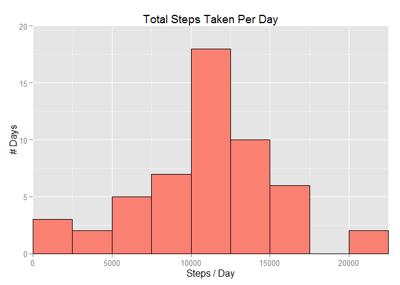
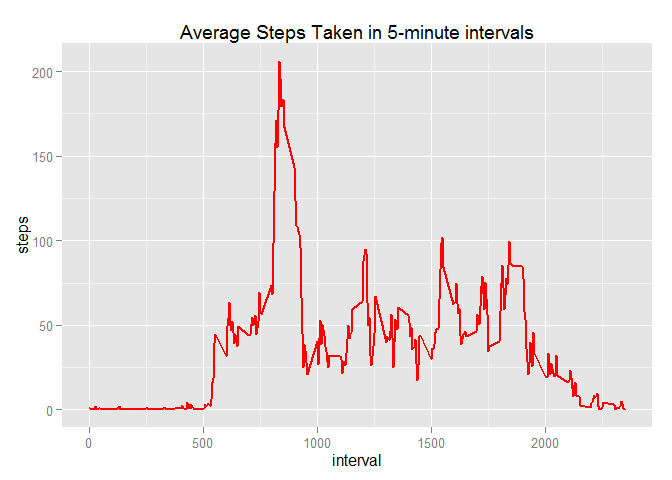
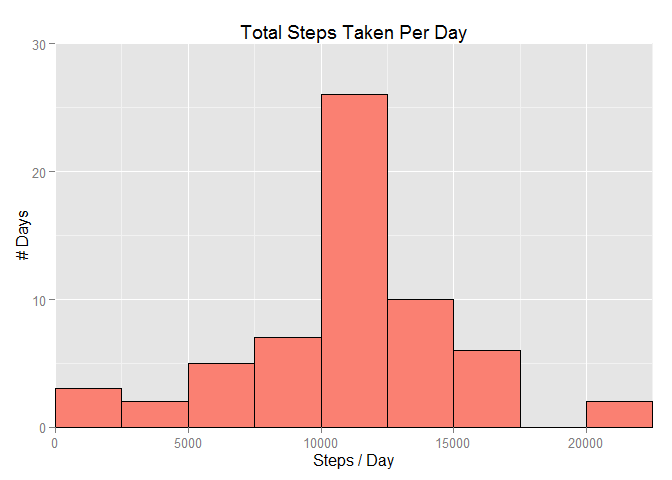
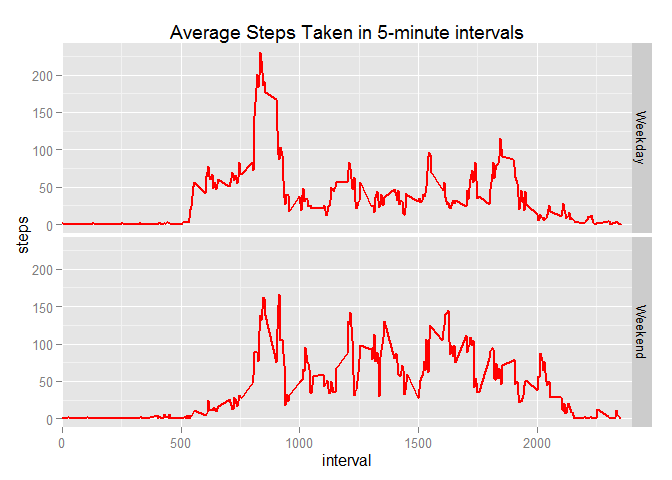

# Reproducible Research: Peer Assessment 1
Author: [Anirban Chatterjee](https://www.coursera.org/user/i/d89e497d386e2a22c006aa6bdd48af2d)  
  
## Loading and preprocessing the data
We expect the csv file to be already present in the working dir and will try to read it.  
If not found, **read.csv** will throw the 'file not found' error and stop.

```r
pa1.data <- read.csv("activity.csv")
```

Also load the ggplot2 package for the graphics. If not installed, the library function will throw an error and stop.  

```r
library(ggplot2)
```

## What is mean total number of steps taken per day?
To calculate this, let's group the data by date and find out the total number of steps taken each day  

```r
pa1.part1 <- aggregate(steps ~ date, data=pa1.data, sum)
```
Now, let's plot the total steps taken each day to understand the extent of variation in the data

```r
g1 <- ggplot(pa1.part1, aes(x=steps))
g1 <- g1 + coord_cartesian(xlim=c(0, 22500), ylim=c(0, 20))
g1 <- g1 + geom_histogram(binwidth=2500, fill="salmon", color="black")
g1 <- g1 + xlab("Steps / Day") + ylab("# Days") + ggtitle("Total Steps Taken Per Day")
g1
```

 
  
As seen from this, there is a significant spread to the total steps taken each day  
But, the symmetric shape of the distribution indicates that the mean and median should be fairly close  
The following R code calculates these quantities  

```r
pa1.part1.mean <- round(mean(pa1.part1$steps))
pa1.part1.median <- round(median(pa1.part1$steps))
```

```
## [1] "Mean number of steps taken each day =  10766"
```

```
## [1] "Median number of steps taken each day =  10765"
```
This confirms our observation from the graph  
  

## What is the average daily activity pattern?
For this section, we will group the data by the time intervals and calculate the average steps taken in each 5-minute interval, the average being taken across all 61 days of observation  

```r
pa1.part2 <- aggregate(steps ~ interval, data=pa1.data, mean)
```
Again, lets start with a plot to get a feel of how a day's walking pattern might look like  

```r
g2 <- ggplot(pa1.part2, aes(x=interval, y=steps))
g2 <- g2 + geom_line(color="red", size=1) + ggtitle("Average Steps Taken in 5-minute intervals")
g2
```

 
  
We notice a sharp spike in the morning hours, especially, just before 10 am  
This might indicate the usual morning office commute, but let's find out the exact 5-minute interval when the biggest spike occurs  

```r
pa1.part2[which.max(pa1.part2$steps),1]
```

```
## [1] 835
```
The spike occurs at 8:35 am, confirming our observation from the plot  
  

## Imputing missing values
For this part, let's start with a count of all the missing values in the data  
Notice that all the NA values are only in the **'steps'** variable of the data

```r
pa1.part3.naCount.steps <- length(pa1.data$steps[is.na(pa1.data$steps)])
pa1.part3.naCount.date <- length(pa1.data$steps[is.na(pa1.data$date)])
pa1.part3.naCount.interval <- length(pa1.data$steps[is.na(pa1.data$interval)])
```
Count of missing values in the data

```
## [1] "In variable steps :  2304"
```

```
## [1] "In variable date :  0"
```

```
## [1] "In variable interval :  0"
```
  
To impute the missing values in **steps**, we will calculate the mean values for each 5-minute interval and use them to replace the NAs  

```r
pa1.part3.meanSteps <- aggregate(steps ~ interval, data=pa1.data, mean)
pa1.part3 <- merge(pa1.data, pa1.part3.meanSteps, by="interval", suffixes=c(".orig", ".mean"))
pa1.part3$steps.orig[is.na(pa1.part3$steps.orig)] <- pa1.part3$steps.mean[is.na(pa1.part3$steps.orig)]
pa1.part3$steps.mean <- NULL
pa1.part3 <- pa1.part3[, c(2, 3, 1)]
colnames(pa1.part3)[1] <- "steps"
```
Now, we also need to understand the impact of the imputation process on the **steps** variable, especially how the central tendencies (i.e. the mean and the median) may have changed  
To this end, let's recreate the plot of total number of steps taken each day and look at the shape and structure of the distribution  

```r
pa1.part3.totalSteps <- aggregate(steps ~ date, data=pa1.part3, sum)
g3 <- ggplot(pa1.part3.totalSteps, aes(x=steps))
g3 <- g3 + coord_cartesian(xlim=c(0, 22500), ylim=c(0, 30))
g3 <- g3 + geom_histogram(binwidth=2500, fill="salmon", color="black")
g3 <- g3 + xlab("Steps / Day") + ylab("# Days") + ggtitle("Total Steps Taken Per Day")
g3
```

 
  
Comparing with the first plot, we see that the central buckets have been extended and the overall distribution has become narrower in shape  
To quantify this, let's take another look at the mean and median of this new distribution  

```r
pa1.part3.mean <- round(mean(pa1.part3.totalSteps$steps))
pa1.part3.median <- round(median(pa1.part3.totalSteps$steps))
```

```
## [1] "Mean number of steps taken each day =  10766"
```

```
## [1] "Median number of steps taken each day =  10766"
```
If we compare the two means and medians, the values are still very close, so the imputation process has not significantly impacted the central tendencies  
  

## Are there differences in activity patterns between weekdays and weekends?
Let's take the imputed data from the last section and start with creating a new variable in the data to flag weekend and weekday dates separately  
We will then group the data by the 5-minute intervals and the weekend flag to calculate the average number of steps taken in each interval for the two cases of weekdays and weekends  

```r
pa1.part4 <- pa1.part3
pa1.part4$Weekend <- as.factor(ifelse(weekdays(as.Date(pa1.part4$date, "%Y-%m-%d"), abbreviate=TRUE) %in% c("Sat", "Sun"), "Weekend", "Weekday"))

pa1.part4.avgSteps <- aggregate(steps ~ interval + Weekend, data=pa1.part4, mean)
```
Now we will plot this average over the groups and separately look at the plots for the two cases  

```r
g4 <- ggplot(pa1.part4.avgSteps, aes(x=interval, y=steps))
g4 <- g4 + geom_line(color="red", size=1)
g4 <- g4 + facet_grid(Weekend ~ .)
g4 <- g4 + coord_cartesian(xlim=c(0, 2400)) + ggtitle("Average Steps Taken in 5-minute intervals")
g4
```

 
  
Clearly, walking as an activity has sharply defined peaks and troughs during the weekdays, while the activitiy on the weekends tends to be more distributed  
  
  
This concludes the first Peer Assessment assignment for the Reporducible Research course on Coursera  
Feel free to reach out to me (contact details at the top of the page) for any queries  
**<i>Thanks for your time and patience in going through the material!</i>**
